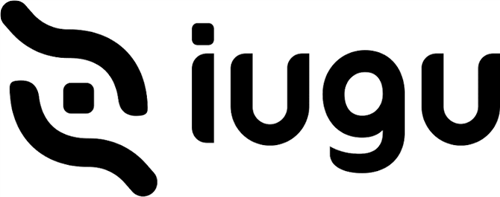

# Módulo Iugu para WHMCS - Pix, Boleto e Cartão



Gateway de pagamento que liga o seu WHMCS a uma conta [Iugu](https://iugu.com).
Emite **Pix** com QR code, **boleto** com linha digitável e cobra no **cartão de
crédito**, e dá baixa na fatura sozinho quando o dinheiro entra.

**Código aberto, uso gratuito, venda proibida.** Sem ionCube, sem verificação de
licença, sem telemetria. Tudo que o módulo faz está aqui, legível.

> Não é um módulo oficial da Iugu. É um projeto independente, publicado por
> Edilson Souza - [Hostcel](https://www.hostcel.com.br).

---

## Índice

- [O que ele faz](#o-que-ele-faz)
- [Requisitos](#requisitos)
- [Instalação](#instalação) - passo a passo em [INSTALACAO.md](INSTALACAO.md)
- [Configuração](#configuração) - cada campo em [CONFIGURACAO.md](CONFIGURACAO.md)
- [Arquivos: caminho e função](#arquivos-caminho-e-função)
- [Como funciona por dentro](#como-funciona-por-dentro)
- [Segurança](#segurança)
- [O que ele NÃO faz](#o-que-ele-não-faz)
- [Licença](#licença)

---

## O que ele faz

**A cobrança nasce junto com a fatura.** Quando o WHMCS gera a fatura, o módulo
já emite o Pix e o boleto na Iugu e guarda o copia-e-cola e a linha digitável.
Na hora de cobrar por WhatsApp ou e-mail, o código já está pronto - não precisa
esperar a API, e o cliente não recebe um código diferente a cada aviso.

**A baixa é conferida, não confiada.** O webhook da Iugu nunca é aceito pelo que
ele diz. O módulo pega só o identificador da cobrança, pergunta à API da Iugu
qual é o status real, e só então quita a fatura. Um POST forjado não paga
fatura nenhuma.

**O que o webhook não entregar, o cron pega.** Uma conferência diária reconsulta
as cobranças ainda pendentes e baixa as que foram pagas. É o que evita o pior
caso: cliente pagou, fatura em aberto, serviço suspenso.

**Pagou um meio, os outros param de valer.** Quando o Pix cai, o boleto que
estava com o cliente é cancelado na Iugu - e vice-versa. Sem pagamento duplo.

**Valor mudou, cobrança acompanha.** Se o admin altera itens de uma fatura em
aberto, o módulo cancela a cobrança antiga na Iugu e emite outra com o valor
novo. (A Iugu recusa duas cobranças com o mesmo `order_id`; o módulo resolve
isso sozinho.)

---

## Requisitos

| | |
|---|---|
| WHMCS | 8.x ou 9.x |
| PHP | 8.1 ou superior |
| Extensões PHP | `curl`, `json` (padrão em qualquer hospedagem com WHMCS) |
| Conta Iugu | com Pix e/ou boleto habilitados no painel deles |
| HTTPS | obrigatório - o webhook e o cartão não funcionam em HTTP |

Não usa Composer, não baixa dependência, não precisa de ionCube Loader.

---

## Instalação

Resumo em quatro passos. O passo a passo com telas está em
**[INSTALACAO.md](INSTALACAO.md)**.

1. Copie `modules/`, `includes/` e `verpix.php` deste repositório para a **raiz do seu WHMCS**,
   preservando a estrutura. Nada é sobrescrito: todos os arquivos são novos.
2. No admin: **Configurações ▸ Pagamentos ▸ Gateways de Pagamento ▸ Todos os
   Gateways de Pagamento** → clique em **Iugu - Pix, Boleto e Cartão**.
3. Preencha o **Token de API (produção)** e o **ID da conta**, escolha as formas
   de pagamento e salve.
4. No painel da Iugu, em **Configurações ▸ Gatilhos**, cadastre o evento
   `invoice.status_changed` apontando para:
   `https://SEU-WHMCS/modules/gateways/callback/iugu.php`

---

## Configuração

Cada campo da tela está explicado em **[CONFIGURACAO.md](CONFIGURACAO.md)**, com
o que acontece se ficar em branco e o que costuma dar errado.

Resumo dos campos:

| Campo | Para quê |
|---|---|
| Token de API (produção) | Credencial da Iugu. Sem ela o módulo não faz nada. |
| Token de API (teste) | Credencial de sandbox; só usada com o Modo em `test`. |
| ID da conta | Obrigatório para o cartão. |
| Modo | `live` ou `test`. |
| Aceitar Pix / boleto / cartão | Quais formas aparecem para o cliente. |
| Pix vale por | 1 a 30 dias. Enquanto valer, o mesmo código é reaproveitado. |
| Parcelas no cartão | Máximo oferecido ao cliente. |
| Multa por atraso (%) | Percentual único depois do vencimento. `0` desliga. |
| Juros ao mês (%) | Proporcional por dia de atraso. `0` desliga. |
| A Iugu não envia e-mail | Marcado, quem avisa o cliente é o WHMCS. |
| Campo do CPF/CNPJ | Onde procurar o documento quando o campo nativo está vazio. |
| Link do verpix | Página pública de pagamento. Vem preenchida com o endereço da sua instalação. |
| Conferência diária | Reprocessa no cron o que o webhook não confirmou. |
| Log de diagnóstico | Desligado por padrão. Ligue só para investigar. |

Na mesma tela, logo acima do botão de salvar, o módulo mostra um quadro com a
**versão instalada**, a **última publicada**, o **changelog** quando há novidade
e os links de **documentação** e **suporte**.

---

## Arquivos: caminho e função

Todos os caminhos são a partir da **raiz do WHMCS**.

### O gateway

| Caminho | Linhas | Função |
|---|---:|---|
| `modules/gateways/iugu.php` | 821 | Porta de entrada do WHMCS. Declara os metadados, os campos de configuração, cria a tabela na ativação, desenha a tela de pagamento da fatura e trata o estorno. |
| `modules/gateways/iugu/config.php` | 236 | Versão instalada, links do projeto, leitor do manifesto de atualização, caminho do log e o token anti-CSRF. É incluído por todo o resto. |
| `modules/gateways/iugu/IuguClient.php` | 275 | Cliente HTTP da API da Iugu, em cURL puro. Todo método devolve o mesmo formato, com `ok` já resolvido - inclusive em falha de rede. |
| `modules/gateways/iugu/IuguInvoice.php` | 288 | Monta o payload de cada forma de pagamento e normaliza a resposta. Quem chama não precisa conhecer o formato da Iugu. |
| `modules/gateways/iugu/IuguHelpers.php` | 383 | CPF/CNPJ (validação e busca no cadastro), telefone em DDD + número, reais em centavos, itens da fatura, expiração. |
| `modules/gateways/iugu/IuguCharges.php` | 234 | Única porta de entrada da tabela `mod_iugu_charges`: gravar, achar cobrança válida, cancelar as irmãs, listar pendentes. |
| `verpix.php` | 560 | Página pública de pagamento - o link que você manda por WhatsApp. Fica na RAIZ do WHMCS. Protegida por token assinado: sem ele responde 404. |
| `includes/hooks/iugu.php` | 55 | **Não pode faltar.** Carregador dos hooks. O WHMCS só detecta o `hooks.php` de dentro da pasta em módulo de provisionamento, registrar e addon - gateway não entra nessa lista. Sem este arquivo, nada que o módulo faz sozinho acontece. |
| `modules/gateways/iugu/hooks.php` | 470 | Tudo que acontece sozinho: emitir na criação da fatura, garantir antes do lembrete, reemitir quando o valor muda, cancelar quando a fatura é anulada, link no admin, cron diário e o quadro de suporte. Carregado pelo arquivo acima. |
| `modules/gateways/iugu/admin_panel.php` | 164 | Só o HTML do quadro de versão e suporte que aparece na tela de configuração. |
| `modules/gateways/iugu/whmcs.json` | - | Metadados que fazem o módulo aparecer com logo, categoria e descrição em **Sistema ▸ Apps e Integrações**. |
| `modules/gateways/iugu/logo.png` | - | Imagem usada por essa tela. |
| `modules/gateways/iugu/.htaccess` | - | Bloqueia acesso web aos arquivos de biblioteca, liberando só os dois endpoints AJAX. |

### Os endpoints

| Caminho | Quem chama | Função |
|---|---|---|
| `modules/gateways/iugu/create_charge.php` | O navegador do cliente, na página da fatura | Emite Pix, boleto ou cobra o cartão. Exige sessão, token assinado e que a fatura seja do cliente logado. |
| `modules/gateways/iugu/check_status.php` | O navegador do cliente, a cada 6 s | Responde `{"paid":true\|false}`. Lê só o WHMCS, não chama a Iugu. |
| `modules/gateways/callback/iugu.php` | A Iugu | Webhook. Recebe o gatilho, reconsulta o status na API e dá a baixa. |
| `modules/gateways/iugu/reconcile.php` | O cron diário do WHMCS (ou a linha de comando) | Confere as cobranças pendentes e baixa as pagas. Não abre pelo navegador. |

### O banco

Uma tabela, criada na ativação e **preservada na desativação**:

`mod_iugu_charges` - uma linha por (fatura, forma de pagamento).

| Coluna | Guarda |
|---|---|
| `whmcs_invoice_id`, `whmcs_client_id` | A fatura e o cliente no WHMCS |
| `iugu_invoice_id`, `iugu_charge_id` | Os identificadores do lado da Iugu |
| `method` | `pix`, `boleto`, `card` ou `open` |
| `status` | `pending`, `in_analysis`, `paid`, `canceled`, `expired`, `refunded`, `failed` |
| `qrcode_base64`, `qrcode_text` | A imagem e o copia-e-cola do Pix |
| `bank_slip_barcode`, `bank_slip_pdf` | A linha digitável e o PDF do boleto |
| `secure_url` | Página de pagamento da cobrança |
| `amount_cents`, `fees_cents` | Valor e taxas, em centavos |
| `expires_at`, `paid_at` | Até quando vale e quando foi pago |

Para remover de verdade, depois de desativar o gateway:
`DROP TABLE mod_iugu_charges;`

---

## Como funciona por dentro

**Fatura criada**
```
WHMCS gera a fatura
      ↓  hook InvoiceCreated
hooks.php → iugu_hook_ensure_charges()
      ↓
IuguInvoice::createPix()   → API da Iugu → guarda o copia-e-cola
IuguInvoice::createBoleto() → API da Iugu → guarda a linha digitável
```

**Cliente abre a fatura**
```
iugu_link() desenha os botões (não emite nada)
      ↓  cliente escolhe Pix
create_charge.php  ── sessão + token + dono da fatura ──►  reaproveita
                                                            se ainda vale
      ↓ senão, emite na Iugu e guarda
tela mostra o QR e passa a perguntar a check_status.php
```

**Cliente paga**
```
Iugu dispara o gatilho  →  callback/iugu.php
                              ↓  NÃO acredita no POST
                           getInvoice() na API da Iugu
                              ↓  status == paid?
                           addInvoicePayment()  →  fatura quitada
                           cancela as cobranças irmãs
                              ↓
check_status.php passa a responder paid=true → a tela do cliente recarrega
```

**O gatilho não chegou**
```
cron diário  →  reconcile.php  →  reconsulta cada pendente na Iugu
                                   →  baixa as que foram pagas
```

---

## Segurança

O que foi feito, e por quê:

- **O webhook não é uma fonte confiável.** A Iugu não assina os gatilhos dela
  (a documentação informa apenas o IP de saída). Por isso a baixa nunca sai do
  POST: o módulo consulta a API antes. Além disso existe o campo **Segredo do
  webhook** - preenchido, o endereço cadastrado na Iugu passa a levar
  `?key=SEGREDO` e requisições sem a chave são recusadas antes de qualquer
  consulta, para o endereço não virar um jeito de fazer o seu servidor
  martelar a API.
- **Emissão só para o dono da fatura.** `create_charge.php` exige sessão de
  cliente, confere um token assinado (HMAC, comparado com `hash_equals`) e só
  atende fatura cujo `userid` é o da sessão. Não existe emissão anônima nem por
  número de fatura.
- **O erro que o cliente vê é genérico.** Mensagem de exceção, caminho de
  arquivo e linha ficam no log do servidor.
- **O log fica fora da pasta publicada.** Vai para o diretório temporário do
  sistema, e é **desligado por padrão**. Nele não entra payload de webhook nem
  documento de cliente (LGPD).
- **O número do cartão não passa pelo seu servidor.** A `iugu.js` troca os
  dados por um token no navegador do cliente; o servidor só vê o token.
- **Certificado sempre verificado.** `CURLOPT_SSL_VERIFYPEER` e
  `VERIFYHOST` ligados. Não desligue para "resolver" erro de SSL.
- **Baixa duplicada é barrada** por `checkCbTransID`, usando o ID da fatura da
  Iugu como identificador - o mesmo no webhook, no cartão e na conferência.

O detalhe de cada decisão - e o que o módulo deliberadamente não faz - está em
**[SEGURANCA.md](SEGURANCA.md)**. Vale ler antes de instalar.

Achou um problema de segurança? Abra uma
[issue](https://github.com/Hostcel/iugu-whmcs/issues) sem detalhar a exploração,
que a gente combina o resto.

---

## O que ele NÃO faz

Dito com todas as letras, para ninguém instalar esperando:

- **Não guarda cartão para cobrança automática.** `TokenisedStorage` está
  declarado como `false` de propósito. A versão 1.0 declarava `true` sem
  implementar, e o WHMCS oferecia uma recorrência no cartão que nunca
  acontecia. Está no roteiro; enquanto não estiver pronto, fica `false`.
- **Não tem tela de relatório no admin.** O que existe é o link da cobrança na
  própria fatura e o quadro de versão na tela de configuração.
- **Não faz split de pagamento, assinatura Iugu, saque nem antecipação.**
- **Não traz uma página de pagamento própria.** O cliente paga pela tela da
  fatura do WHMCS ou pela página da própria Iugu. O campo *Link de pagamento
  para o cliente* serve para apontar uma página SUA, se você tiver - em branco,
  usa a da Iugu.
- **Não faz parcelamento com juros calculados por ele.** As parcelas são
  oferecidas até o máximo configurado; quem define juros e quem paga é o
  painel da Iugu.

---

## Licença

**Licença de Proteção a Código Aberto Não Comercializável**, redigida por
Edilson Souza (Hostcel). Texto completo em **[LICENSE](LICENSE)**.

Em uma linha: **use, leia, audite, modifique e redistribua de graça - vender é
proibido**, inclusive versão modificada. Cobrar pelo seu trabalho de instalação
ou consultoria é permitido; cobrar pelo módulo, não.

Amparo legal: Lei 9.610/1998 e Lei 9.609/1998.

---

Desenvolvido por **Edilson Souza** - [Hostcel](https://www.hostcel.com.br).
